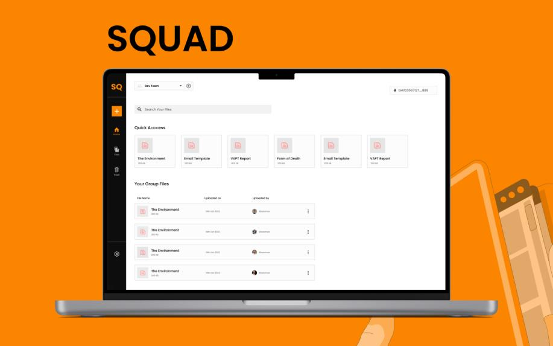
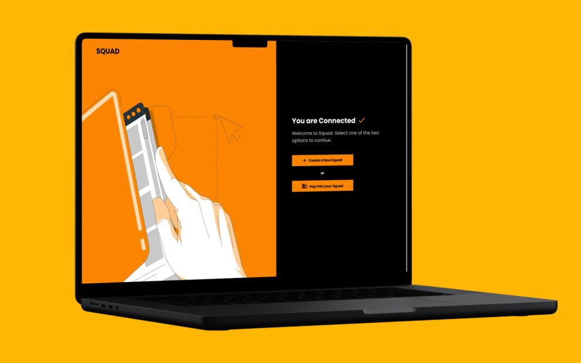
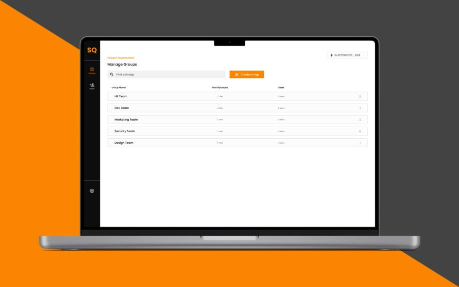

# **SQUAD** - by **cod3ine**

  

#### We're building **_SQUAD - On-Chain Encrypted AES-RSA File Management._**

## What is SQUAD?

Squad is a 100% on-chain dApp that helps teams manage and share their files with a unique encryption layer between IPFS and their workflows, allowing for access control within different teams.

## The Problem it solves

In the world where Web3 and decentralisation is becoming mainstream, It is becoming more and more important to build proper org structures to manage different aspects of a DAO.

Existing solutions for team management on Web3 personal projects by kids that are not well developed, and are just built on top of IPFS making all the **information available to everyone**.

**Existing encryption solutions** are weak and can not scale beyond managing one person which makes sense as these softwares are only useful for personal use.

## Challenges we ran into

- Building the encryption scheme: since there is nothing of this sort on the planet, we came up with a unique encryption scheme combining asymmetric and symmetric encryption to allow only people in a particular group of an organisation to access each others files whereas other teams will be unable to access them(will not be able to decrypt them)

- Edge cases: one interesting case that was especially challenging to tackle was when a new person is being added to a team. When the user joins, he would not have access to any file in the organisation as his public key will be new. We were able to tackle this by dynamically decrypting all aes keys by the admin user who adds people to the organisation and re encrypting them with the new public key and storing them on IPFS

- Implementing new protocols like **biconomy** and **Push protocols** was challenging as we had never worked with them before. But once we were comfertable with them, we were able to implement them well

## Sneak peek of our application

  

  

  

## TECH USED

- Figma
- ethers
- biconomy
- Push Protocol
- IPFS
- Truffle
- Polygon Network
- Solidity

## OUR TEAM

1. [Kathan Desai](https://github.com/kathan3009)
2. [Dhruva Goyal](https://github.com/shero4)
3. [Aditya Mohan](https://github.com/adityamhn)
4. [Sitaraman S](https://github.com/hackerbone)
5. [Jyothsna Ashok](https://github.com/JyothsnaAshok)

## LINKS

- [Website](https://squad-dapp.vercel.app)
- [Product Demo Video](https://youtu.be/JP5qHZx1qRA)
- [Figma Design](https://www.figma.com/file/waAIa4A9hH3Shh5iicICH4/Mrex%2B%2B?node-id=0%3A1&t=hh1ck85YU7LuRdfn-1)
- [Pitch Deck](https://drive.google.com/file/d/1byP_f0x6M4G5rWOEJplpq-Oa1BQNSurh/view?usp=share_link)
<!-- - [Product Demo]() -->
